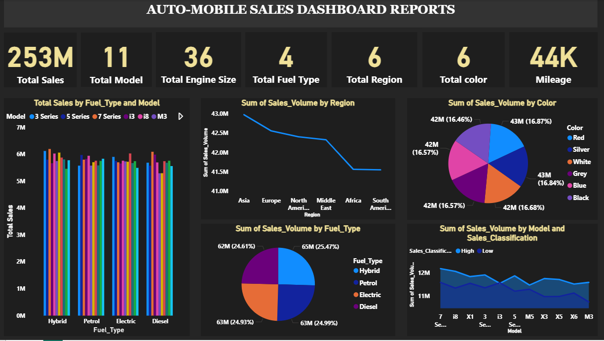

# Auto_Mobile_ Sales Reports

> This project was designed to helps stakeholder monitor key metrics, identify market trends , and make data-driven decisions in the automotive sector.

## 📌 Overview
An interactive automobile sales dashboard that provides a deep dive into sales performance across regions, fuel,type, colours and models.

**View live project:** [View Dashboard](https://novyproo-my.sharepoint.com/:u:/g/personal/koredeenock23_novypro_com/IQCa1QZB5r6-TrqvY-D8m7efAUsTCCTdzE7ioAcizZS3U34?e=DjtEIY)

## ✨ Features
- Microsoft Excel for data cleaning 
- modern deep charcoal theme(#121212) for better readability
- Custome fuel-type colour coding
- Visual include: sales by region, fuel type distribution, model classification, mileage overview
  

## 🛠️ Tech Stack
- Language: ( Python,Excel,and PowerBI)
- Framework: (Flask)

````

## 🚀 Installation

```bash
https://github.com/KoredeTheDataAnalyst/Auto_-Mobile-Sales-Report/edit/main/README.md
Auto-mobile sales reports
````

## ▶️ Usage

```bash

```

## 📸 Screenshots (Optional)

.

## 🤝 Contributing

Contributions are welcome!

## 📄 License

This project is licensed under the MIT License.

## 👤 Author

* Name
* GitHub: [@username](https://github.com/username)

```

---
